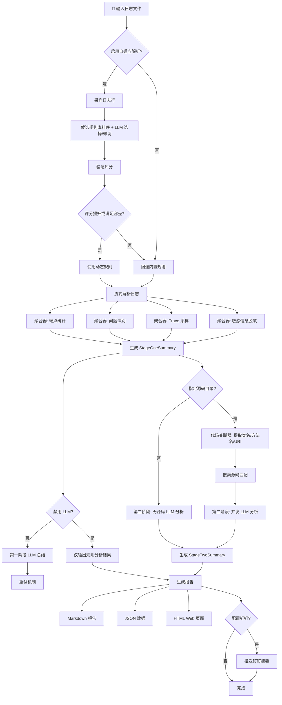
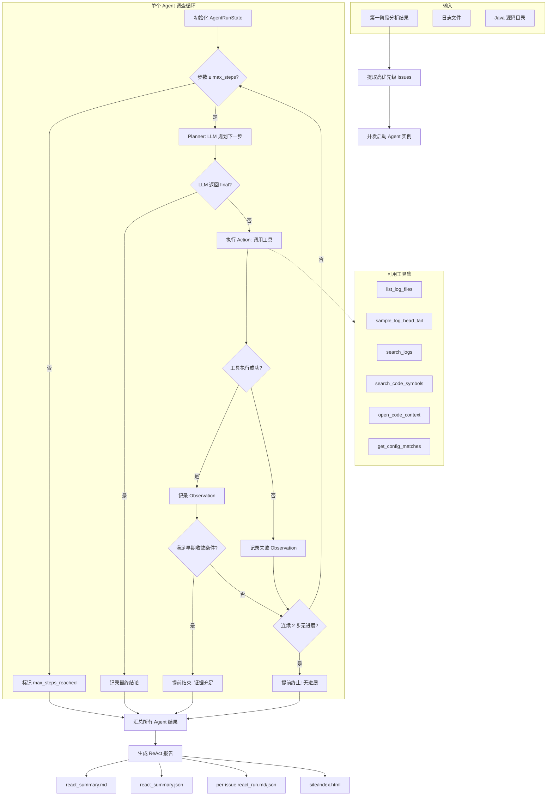
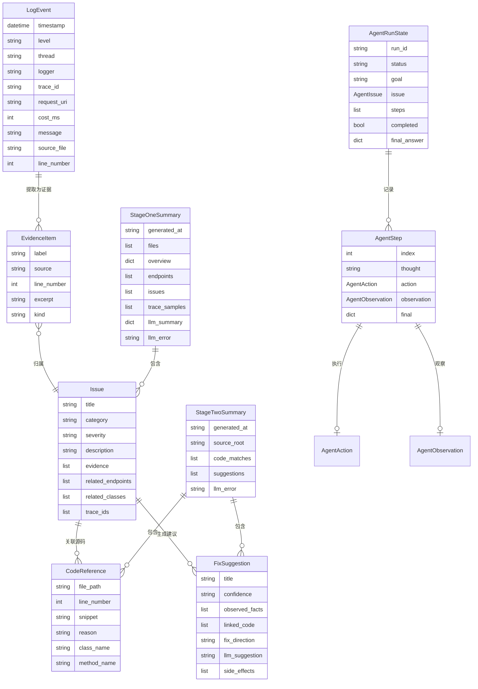

# 日志分析工具

面向常见 Java 后端日志的两阶段分析 CLI，支持规则分析、LLM 辅助诊断和 ReAct 多步 Agent 调查。

## 核心模式

项目提供三种递进的分析模式：

| 模式 | 命令 | 说明 |
| ---- | ---- | ---- |
| **第一阶段**（规则分析） | `analyze-logs` | 纯规则引擎解析日志，识别问题模式，输出结构化摘要 |
| **第二阶段**（LLM 辅助） | `analyze-logs --source-root <path>` | 日志关联源码，并发调用 LLM 生成修复建议 |
| **ReAct 模式** | `analyze-logs-react --source-root <path>` | 多步 Agent 调查，自主调用工具链做深度排查 |

## 实现原理

### 整体架构

项目采用管道式（Pipeline）架构，按数据流向分为六个核心模块：

```text
日志文件 → 解析器 → 聚合器 → LLM 总结 → 代码关联 → 报告发布
                ↑                        ↓
          自适应解析器              ReAct Agent 工具链
```

### 模块设计

#### 1. 日志解析器 (`parser.py`)

采用**多正则模式匹配**策略，按优先级依次尝试：

- **标准格式**: `时间 [线程] 级别 类名 [TID: ...] [traceId] - 消息`
- **时间简写格式**: `HH:mm:ss.SSS [线程] 级别 logger - [location] - 消息`
- **包装格式**: 外部日志框架包裹的内部日志行
- **嵌入式时间格式**: 消息体内嵌的时间简写日志

每条日志行解析为 `LogEvent` 数据类，包含时间戳、级别、线程、logger、traceId、spanId、请求 URI、耗时等字段。解析过程使用**惰性生成器**（generator），支持流式读取大文件而不全量加载到内存。

#### 2. 自适应解析器 (`adaptive_parser.py`)

这一版 adaptive parser 的目标不是“让 LLM 自由写正则”，而是先由本地规则库提供一组**受约束的候选模板**，再让 LLM 在候选里做选择或极小范围微调。这样能显著降低解析漂移、错误命名组、时间格式失配这类问题。

建议把它理解成一条“四层保险”的链路：

```text
样本采集
  → 本地候选模板库排序
  → LLM 选择候选 / 微调少量字段
  → 本地验证、评分、决策、必要时回退
```

### Adaptive Parser 工作机制

#### 1. 本地候选规则库

当前内置的候选模板主要覆盖几类常见 Java 后端及周边日志：

- `spring_tid_trace`
  适合标准 Spring 风格、带 `TID` / `traceId` 的文本日志。
- `spring_json_plain`
  适合 JSON 行日志或接近 JSON 结构的 Spring 输出。
- `spring_boot_pid_thread`
  适合 Spring Boot 启动类日志，例如 `timestamp level pid --- [thread] logger : message`。
- `time_only_method`
  适合只有 `HH:mm:ss.SSS` 时间、没有日期的简写日志。
- `nacos_dubbo_bootstrap`
  适合 Nacos、Dubbo、配置中心、启动引导类日志。
- `wrapper_embedded_spring`
  适合 Tanuki / Java Service Wrapper 外层包裹、消息体中再嵌套 Spring 日志的格式。
- `tanuki_wrapper_plain`
  适合 Wrapper 外层日志本身就足够可解析的场景。
- `tomcat_catalina_juli`
  适合 Tomcat Catalina / JULI 风格日志。

这些模板都不是一次性硬编码死规则，而是“候选库 + 场景评分”的组合。不同日志类型会先做本地匹配打分，再决定是否值得交给 LLM 参与。

#### 2. 采样与候选排序

当传入 `--adaptive-parser` 时，程序不会直接对整份大日志做动态推断，而是先抽取一个可控样本集：

- 默认采样前 `80` 行，可通过 `--adaptive-sample-lines` 调整。
- 会额外补采包含 `ERROR`、`WARN`、`Exception`、`Caused by`、`timed out`、`Fallback` 等关键词的代表性行。
- 样本既用于“让 LLM 看懂格式”，也用于“本地评分比较 adaptive 是否真的优于内置解析器”。

本地排序时会考虑：

- 时间戳是否能稳定命中
- 日志级别是否可抽取
- 线程名、logger、消息体是否结构清晰
- 是否包含典型场景特征
  - 例如 Wrapper 外层前缀
  - Nacos / Dubbo / bootstrap 关键词
  - 内嵌 Spring 日志的二层结构

其中 `wrapper_embedded_spring` 的评分逻辑专门做过收紧：只有先命中外层 Wrapper，再在消息体里命中内嵌 Spring 结构，才会拿到额外加权，避免把普通行误判成嵌套日志。

#### 3. LLM 的职责边界

LLM 在 adaptive parser 里是“受约束协助者”，不是自由生成器。它的职责被限定为：

- 从候选规则中选择最合适的 `candidate_name`
- 在必要时返回少量 `tuned_fields`
- 解释为什么这个候选更适合当前样本

它**不应该**凭空生成一套完全新的高自由度 regex。这样做是为了尽量把稳定性保留在本地规则系统里，把 LLM 的价值用在“识别日志风格”和“微调少量参数”上。

#### 4. 启用条件

adaptive parser 只有在“确实比内置解析器更好”时才会被启用。当前启用判定主要包括三层：

1. 规则必须合法

- 正则需要可编译
- 命名捕获组只能使用系统允许的字段名
- 时间格式必须可转换为 Python `strptime`
- 动态规则不能突破安全边界

2. 采样评分必须达标

- 程序会分别计算“内置解析器得分”和“动态规则得分”
- 默认要求动态规则至少比内置规则高 `1` 分
- 这个阈值由 `adaptive_validation_improvement` 控制，当前默认值已经从早期版本的 `3` 下调到了 `1`

3. 白名单模板可以走更温和的启用策略

当前有几个模板允许在“打平”或“小分差”时启用：

- `wrapper_embedded_spring`
- `nacos_dubbo_bootstrap`
- `time_only_method`

这样做是因为这些场景往往存在天然噪声，例如：

- Wrapper 外层行和内层真实业务日志混排
- 启动日志里大量 banner / bootstrap 行
- `Caused by`、堆栈续行天然不满足完整结构
- 时间简写日志需要结合文件名补日期

#### 5. 回退策略

adaptive parser 的一个核心目标是“宁可回退，也不要把主流程搞坏”。因此它内置了多层回退：

- LLM 不可用时，继续走内置解析器
- LLM 返回内容不是合法 JSON 时，尝试做一次 JSON 修复
- 修复仍失败时，回退到本地内置规则
- 如果动态规则评分没有明显提升，回退到内置规则
- 如果规则安全校验失败，回退到内置规则

此外还有一个重要兜底：

- 如果 LLM 返回不合法，但本地候选库里某个模板分数**明显领先**，系统会直接采用这个高置信本地候选，而不是把整轮 adaptive 判成失败

这也是为什么现在的 adaptive parser 更像“本地规则主导，LLM 协助决策”，而不是“完全依赖 LLM 生成解析规则”。

#### 6. 特殊能力

当前 adaptive parser 额外支持两类对真实日志很实用的能力：

1. 文件名补日期

对于只写 `HH:mm:ss.SSS` 的日志，如果文件名里带有类似 `2026-07-01` 这样的日期，`time_only_method` 可以自动把日期回填到事件时间戳里。

2. 外层包裹 + 内层日志拆解

对于 Tanuki Wrapper / Java Service Wrapper 这类“外层是 wrapper 前缀，内层才是真正 Spring 日志”的格式，adaptive parser 会优先识别外层，再对消息体做 embedded 判断，而不是简单对整行重复套一遍内嵌规则。

#### 7. 什么时候会启用，什么时候会回退

可以把启用条件简化理解为：

- 命中合适候选
- 候选经过 LLM 选择或微调后仍然合法
- 样本评分优于内置规则，或者满足白名单容差条件

以下情况通常会回退：

- 样本太少，无法证明动态规则更优
- 当前日志其实已经被内置解析器很好处理
- LLM 选择了不合适的候选
- LLM 返回结构损坏且本地也没有明显领先候选

#### 8. 输出与可观测性

启用 `--adaptive-parser` 后，输出目录里会额外生成 `adaptive_parser.json`，用于解释这轮 adaptive 到底发生了什么。该文件通常会包含：

- `enabled`
  是否最终启用了动态规则
- `reason`
  启用或回退原因
- `base_score`
  内置规则样本评分
- `dynamic_score`
  动态规则样本评分
- `sample_lines`
  实际参与判断的采样规模
- `dynamic_rule`
  最终采用的候选或微调后规则
- `llm_response`
  LLM 原始或修复后的结构化结果

如果你在真实验收里想判断 adaptive 是否“有命中价值”，最直接的方法就是看这个文件里的 `enabled`、`reason`、`base_score` 和 `dynamic_score`。

#### 3. 聚合器 (`aggregator.py`)

遍历所有 `LogEvent`，执行以下分析：

- **端点统计**: 按请求 URI 聚合，计算请求数、平均耗时、慢请求数、错误数、下游依赖
- **问题识别**: 基于规则引擎匹配已知模式——
  - 超时（`timed out`、`TimeoutException`）
  - 连接池告警（`discard long time none received connection`、Druid 告警）
  - 慢请求（耗时超过阈值，默认 1000ms）
  - Fallback（`Fallback Reason`、Hystrix/Sentinel 降级）
  - 未处理异常（`Exception`、`Caused by` 栈）
- **Trace 采样**: 提取典型 traceId 的完整链路日志片段
- **敏感信息脱敏**: 自动脱敏邮箱、手机号、IP 地址、Token

#### 4. LLM 客户端 (`llm.py`)

基于标准库 `urllib` 实现的 OpenAI 兼容客户端，零外部依赖：

- 支持 `/v1/chat/completions` 协议
- 自动从 LLM 响应中提取 JSON（支持 markdown code block 包裹）
- 内置重试机制（可配置次数与退避策略）
- 第一阶段：向 LLM 发送聚合摘要，获取高层分析
- 第二阶段：为每个问题独立构造 prompt 并发请求

#### 5. 代码关联器 (`code_linker.py`)

从日志证据中提取线索，在 Java 源码目录中做静态匹配：

- **类名提取**: 正则匹配 Java 全限定类名、异常栈中的类名
- **方法名提取**: 匹配 `async method:` 标记和 `类.方法(` 模式
- **URI 关联**: 搜索 `@RequestMapping`、`@GetMapping`、`@PostMapping` 等 Spring 注解
- **配置匹配**: 针对数据库连接池问题，搜索 Druid/HikariCP 配置项（`validation-query`、`test-while-idle` 等）
- **配置文件支持**: `.java`、`.kt`、`.xml`、`.yml`、`.yaml`、`.properties`

#### 6. ReAct Agent (`react_controller.py` + `react_tools.py`)

以 Thought → Action → Observation 循环实现多步调查：

```text
Planner (LLM)
    ↓ thought + action
工具执行器 (ToolRegistry)
    ↓ observation
Planner 判断: 继续 / 输出最终结论
```

**六种内置工具**:

| 工具 | 功能 |
| ---- | ---- |
| `list_log_files` | 列出分析范围内的日志文件 |
| `sample_log_head_tail` | 读取日志文件头尾行，快速了解格式 |
| `search_logs` | 按关键字搜索日志并返回上下文 |
| `search_code_symbols` | 在源码中搜索类名、方法名 |
| `open_code_context` | 打开源码文件指定行附近的上下文 |
| `get_config_matches` | 搜索配置文件中的连接池/超时等配置项 |

**收敛策略**:

Agent 通过两种机制避免无意义循环：

1. **早期收敛**: 当同时满足（已有代码上下文 + 日志命中 + 源码命中 + 工具覆盖 ≥2 种）时，自动提前结束调查
2. **无进展终止**: 连续两步工具调用均未产生有效新证据时，提前终止并给出切换策略建议

多个问题的 ReAct 调查通过 `ThreadPoolExecutor` 并发执行。

#### 7. 报告与发布 (`reporter.py` + `publish.py` + `web_cli.py`)

- **Markdown 报告**: 中文结构化报告，包含概述、端点统计、问题详情、修复建议
- **JSON 输出**: 完整结构化数据，包含 `linked_code_groups`（按文件 → 片段块 → 上下文组织）
- **Web 报告**: 自动生成静态 HTML 页面，支持历史报告目录索引
- **钉钉通知**: 可选推送分析摘要到钉钉群
- **本地 Web 服务**: `analyze-logs-web` 启动静态文件服务，浏览历史报告

## 流程图

### 经典两阶段分析流程



### ReAct Agent 多步调查流程



### 数据模型关系



## 覆盖场景

项目重点覆盖以下 Java 后端日志场景：

- Spring Boot / Spring Cloud 风格日志
- Java 异常栈、异步异常、线程池日志
- Feign / HTTP 调用日志
- Druid / JDBC / MyBatis 相关日志
- 带时间、级别、线程名、类名、traceId 的后端服务日志

不建议把当前版本理解成"所有日志都能分析"。更准确地说，它是一个"面向常见 Java 后端日志"的分析工具；如果后续要扩展到 Nginx、Redis、Kafka、前端日志、系统日志等，需要继续增加对应解析器。

## 主要能力

- 流式读取大日志文件，避免一次性加载到内存
- 识别常见问题模式：超时、连接池告警、慢请求、Fallback、未处理异常
- 输出中文 Markdown 总结和结构化 JSON
- 默认将分析产物统一写入仓库下的 `output/` 目录
- 自动生成简单 Web 报告页，便于分享和跳转
- 支持启动本地静态 Web 服务浏览历史报告
- 支持可选推送摘要到钉钉群
- 第二阶段支持从日志中提取类名、方法名、接口 URI，并关联到 Java 源码
- 第二阶段按问题分开并发请求 LLM
- LLM 请求失败支持自动重试
- 自适应解析器：当内置规则不够贴合时，使用“本地候选模板库 + LLM 选择/微调 + 本地验证回退”机制提升解析命中率

## 运行环境

### 必需环境

- Python `3.11+`
- `pip`

### 可选环境

- 可访问的 OpenAI 兼容 LLM 服务
- 本项目默认使用：
  - 基础地址：`http://10.130.61.232:8002`
  - 模型名：`InstructModelQwen3`

### 操作系统支持

- macOS
- Linux
- Windows

项目主体仅依赖 Python 标准库，路径处理使用 `pathlib`，因此支持 Windows 盘符路径和反斜杠路径。

## 安装

### 方式一：安装为命令行工具

#### macOS / Linux

```bash
python3 -m venv .venv
source .venv/bin/activate
pip install -e .
```

#### Windows PowerShell

```powershell
py -3 -m venv .venv
.venv\Scripts\Activate.ps1
pip install -e .
```

#### Windows CMD

```bat
py -3 -m venv .venv
.venv\Scripts\activate.bat
pip install -e .
```

安装后可直接使用：

```bash
analyze-logs --help
analyze-logs-react --help
analyze-logs-web --help
```

### 方式二：不安装，直接在源码目录运行

#### macOS / Linux

```bash
PYTHONPATH=src python3 -m log_analysis --help
PYTHONPATH=src python3 -m log_analysis.web_cli --help
```

#### Windows PowerShell

```powershell
$env:PYTHONPATH="src"
py -3 -m log_analysis --help
py -3 -m log_analysis.web_cli --help
```

#### Windows CMD

```bat
set PYTHONPATH=src
py -3 -m log_analysis --help
py -3 -m log_analysis.web_cli --help
```

## 输出目录约定

当前版本默认把所有生成产物统一收口到仓库下的 `output/` 目录。

例如：

- `analyze-logs --output-dir analysis` -> `output/analysis`
- `analyze-logs-react --output-dir react-analysis` -> `output/react-analysis`

如果传相对路径，结果会自动写到 `output/` 下；如果传绝对路径，则会按绝对路径写入。

根目录下还会自动生成：

- `output/index.html`

它是一个历史报告目录页，可统一查看多个分析结果。

## 使用说明

### 查看帮助

```bash
analyze-logs --help
analyze-logs-react --help
analyze-logs-web --help
```

### 只运行第一阶段

```bash
analyze-logs esg-system.log esg-hazsub.log
```

默认输出到：

```text
output/analysis
```

### 运行完整两阶段分析

```bash
analyze-logs esg-system.log esg-hazsub.log --source-root /path/to/java/project
```

### 指定输出目录

```bash
analyze-logs esg-system.log esg-hazsub.log --source-root /path/to/java/project --output-dir my-run
```

会输出到：

```text
output/my-run
```

### Windows 路径示例

```powershell
analyze-logs .\esg-system.log .\esg-hazsub.log --source-root D:\workspace\ums-esgserver --output-dir my-run
```

### 禁用 LLM，仅做规则分析

```bash
analyze-logs esg-system.log --disable-llm
```

### 自定义慢请求阈值

```bash
analyze-logs esg-hazsub.log --slow-threshold-ms 2000
```

### 启用自适应解析器

```bash
analyze-logs esg-system.log --adaptive-parser
```

当日志格式和内置规则不完全匹配时，可以启用自适应解析器。它会先用本地候选模板库做筛选，再让 LLM 在候选中选择或微调，最后由本地评分系统决定是否真正启用该规则。

## 第二阶段行为说明

第二阶段需要传入源码目录：

```bash
analyze-logs esg-system.log esg-hazsub.log --source-root /path/to/java/project
```

当前第二阶段行为如下：

- 先从第一阶段识别出高优先级问题
- 从日志证据中提取：
  - 类名
  - 方法名
  - 接口 URI
  - 关键异常词
- 在源码目录中做静态关联
- 对每个问题单独向 LLM 发起请求
- 并发执行多个问题分析
- 每个问题的 LLM 请求失败时会自动重试
- 输出结果以 LLM 为主，不再用规则建议自动补齐缺失项

这意味着：

- 如果某个问题的 LLM 请求成功，它会出现在 `fix_suggestions.*` 中
- 如果某个问题多次重试后仍失败，会在 `llm_error` 中体现，但不会强行补一条规则建议

## ReAct 模式

### 运行 ReAct 调查

```bash
analyze-logs-react esg-system.log esg-hazsub.log --source-root /path/to/java/project
```

### 常用参数

```bash
analyze-logs-react esg-system.log esg-hazsub.log \
  --source-root /path/to/java/project \
  --max-steps 6 \
  --parallelism 4 \
  --retry-count 3 \
  --output-dir react-analysis
```

ReAct 模式输出目录通常包含：

- `stage1/summary.json`
- `stage1/summary.md`
- `react/react_summary.json`
- `react/react_summary.md`
- `react/issues/.../react_run.json`
- `react/issues/.../react_run.md`
- `site/index.html`
- `publish.json`

## Web 报告服务

### 启动本地报告服务

```bash
analyze-logs-web
```

默认会以 `output/` 作为站点根目录，并启动：

```text
http://127.0.0.1:8765/
```

也可以指定端口：

```bash
analyze-logs-web --port 9000
```

如果你已有 Nginx、反向代理或内网静态站点，可以直接把 `output/` 目录暴露出去，再把外部访问地址配置给分析 CLI。

## 钉钉通知

### 典型用法

```bash
analyze-logs esg-system.log esg-hazsub.log \
  --source-root /path/to/java/project \
  --report-base-url https://example.com/reports \
  --dingtalk-webhook "https://oapi.dingtalk.com/robot/send?access_token=xxx" \
  --dingtalk-secret "SECxxxx"
```

ReAct 模式同理：

```bash
analyze-logs-react esg-system.log esg-hazsub.log \
  --source-root /path/to/java/project \
  --report-base-url https://example.com/reports \
  --dingtalk-webhook "https://oapi.dingtalk.com/robot/send?access_token=xxx" \
  --dingtalk-secret "SECxxxx"
```

行为说明：

- CLI 会先生成本地 HTML 报告
- 如果配置了 `--report-base-url`，会拼出可点击的报告链接
- 如果同时配置了钉钉 webhook，就会推送一条简短摘要到群里
- 如果钉钉推送失败，不会影响分析主流程，结果会写进 `publish.json`

注意：

- 钉钉里的链接必须是钉钉客户端能够访问到的地址
- 仅启动本地 `127.0.0.1` 服务，通常无法让群成员直接点开
- 更适合的方式是把 `output/` 目录挂到已有内网 Web 服务、Nginx、对象存储静态站点，或者反向代理到可访问地址

## 输出文件

### 第一阶段输出

- `summary.json`
  第一阶段结构化分析结果
- `summary.md`
  第一阶段中文 Markdown 总结

### 第二阶段输出

- `fix_suggestions.json`
  第二阶段结构化修复建议
- `fix_suggestions.md`
  第二阶段中文 Markdown 建议报告

### 发布输出

- `site/index.html`
  当前分析结果对应的 Web 页面
- `publish.json`
  发布元数据，例如本地页面路径、外部 URL、钉钉推送结果
- `output/index.html`
  历史报告目录入口

## JSON 输出说明

### `summary.json`

通常包含：

- `overview`
- `files`
- `endpoints`
- `issues`
- `trace_samples`
- `llm_summary`
- `llm_error`

### `fix_suggestions.json`

通常包含：

- `source_root`
- `code_matches`
- `suggestions`
- `llm_error`

其中每条 `suggestion` 现在还会带：

- `linked_code_groups`

它会按"文件 -> 片段块 -> 片段上下文"的方式组织关联代码，便于 Web 页面和报告展示。

## 当前已知限制

- 当前解析器优先支持 Java 后端日志，不保证适配任意日志格式
- 第二阶段依赖日志里能提取出足够强的线索，如类名、方法名、URI、异常文本
- LLM 结果质量依赖模型返回稳定性与证据完整性
- 对于完全非结构化日志，分析效果会明显下降
- Web 报告当前是静态页面，不含登录、权限和数据库

## Windows 兼容说明

- 路径处理使用 `pathlib`
- 输出文件编码为 `UTF-8`
- 运行主程序不依赖 `bash`、`sed`、`grep` 等 Unix 外部工具
- 推荐通过 `analyze-logs`、`analyze-logs-react` 或 `analyze-logs-web` 启动

## 开发与验证

### 运行单元测试

```bash
PYTHONPATH=src python3 -m unittest discover -s tests -v
```

Windows PowerShell：

```powershell
$env:PYTHONPATH="src"
py -3 -m unittest discover -s tests -v
```

### 语法检查

```bash
python3 -m compileall src tests
```

### 启动本地报告服务

```bash
PYTHONPATH=src python3 -m log_analysis.web_cli
```

## 典型场景

- 生产故障初筛
- 大体量 Java 服务日志摘要
- Java 微服务超时 / 连接池 / 异步异常排查
- 从日志快速定位到源码类和方法
- 结合 LLM 生成第一版修复方向
- 将摘要推送到钉钉群，并在网页中查看详细证据与建议
